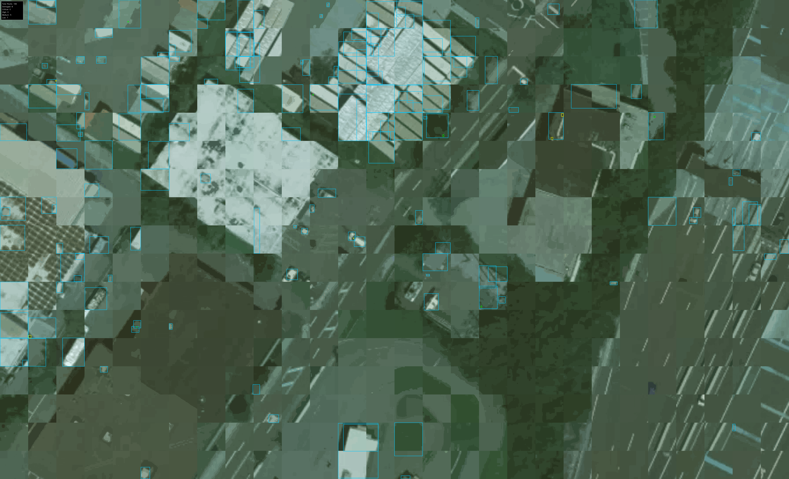

# AI Roof Damage Detection System

Automated roof damage detection from satellite imagery using YOLOv8-segmentation models. Input a US zipcode to fetch satellite images, detect roofs, and identify damage with visual annotations.



## Features

- **Satellite Image Fetching**: Retrieves high-resolution satellite imagery from MapTiler API for any US zipcode
- **Roof Detection**: Uses YOLOv8-segmentation to identify and segment roof boundaries
- **Damage Detection**: Detects and classifies roof damage with severity scoring
- **Image Enhancement**: Applies CLAHE, sharpening, and denoising for better model visibility
- **Visual Output**: Generates annotated images and heatmaps showing detected roofs and damage
- **JSON/GeoJSON Export**: Structured output for integration with mapping tools
- **FastAPI Endpoint**: RESTful API for programmatic access
- **Performance Profiling**: Built-in performance metrics and timing analysis

## Quick Start

### 1. Setup

```bash
# Clone repository
cd AI_Roof_Damage_Detection

# Create virtual environment
python -m venv venv
venv\Scripts\activate  # Windows
# or: source venv/bin/activate  # Linux/Mac

# Install dependencies
pip install -r requirements.txt
```

### 2. Configure API Key

Create a `.env` file in the project root:

```bash
MAPTILER_API_KEY=your_maptiler_api_key_here
```

Get your free API key from [MapTiler](https://www.maptiler.com/cloud/).

### 3. Download Models

Run the model download script:

```bash
python scripts/download_mvp_models.py
```

This downloads pre-trained YOLOv8 models for roof and damage detection from Hugging Face.

### 4. Run Analysis

**Test Script:**
```bash
python test_zipcode.py
```

Edit `test_zipcode.py` to change the zipcode.

**API Server:**
```bash
python -m uvicorn api.main:app --reload
```

Visit `http://localhost:8000/docs` for interactive API documentation.

**API Request:**
```bash
curl -X POST "http://localhost:8000/api/v1/analyze" \
  -H "Content-Type: application/json" \
  -d '{"zipcode": "75201"}'
```

## Output

Results are saved in the `output/` directory:

- `{zipcode}_{timestamp}_annotated.png` - Visualized detections with masks and labels
- `{zipcode}_{timestamp}_heatmap.png` - Damage severity heatmap
- `{zipcode}_{timestamp}.json` - Structured detection results
- `{zipcode}_{timestamp}.geojson` - Geographic data for mapping tools

## Technical Stack

- **Python 3.10+**
- **YOLOv8** (Ultralytics) - Segmentation models
- **PyTorch** - Deep learning framework
- **FastAPI** - Web framework
- **MapTiler API** - Satellite imagery
- **OpenCV** - Image processing
- **Shapely** - Geometric operations
- **Pydantic** - Data validation

## Architecture

1. **Geocoding**: Converts zipcode to bounding box coordinates
2. **Image Fetching**: Downloads satellite tiles from MapTiler at zoom level 21
3. **Image Stitching**: Combines tiles into a single image
4. **Image Enhancement**: Improves visibility with CLAHE, sharpening, denoising
5. **Roof Detection**: YOLOv8-seg identifies roof boundaries
6. **Damage Detection**: YOLOv8-seg detects damage within roof regions
7. **Visualization**: Generates annotated images and heatmaps
8. **Export**: Saves JSON and GeoJSON results

## Models

- **Roof Detector**: `keremberke/yolov8m-building-segmentation` (Hugging Face)
- **Damage Detector**: `JGuevara-12/yolo-roof-damage` (Hugging Face)

Models are automatically downloaded to `models/` directory on first run.

## Memory Optimization

- Lazy model loading
- Image chunking for large areas
- Selective mask storage (polygons for large images)
- Automatic garbage collection and CUDA cache clearing
- Memory-efficient batch processing

## License

See LICENSE file for details.
